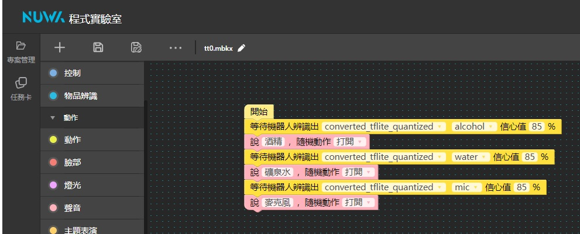

https://developers.line.biz/en/docs/messaging-api/using-flex-messages/#checking-behavior-in-flex-message-simulator  

https://developers.line.biz/en/docs/messaging-api/sticker-list/#sticker-definitions  
https://developers.line.biz/en/docs/messaging-api/emoji-list/  

凱比程式實驗室->https://support.nuwarobotics.com/zh-hant/docs/biztools/codelab/  
  
  

-虛擬環境安裝-  
版本:  
python --version  
 
1->環境變數  
C:\Users\User\AppData\Local\Programs\Python\Python39  
C:\Users\User\AppData\Local\Programs\Python\Python39\Scripts  
  
2->安裝virtualenv  
pip install virtualenv  
virtualenv (取一個名稱)  
virtualenv -p python3.12 (取一個名稱)  
  
3->啟動  
到虛擬環境Scripts目錄中啟動  
activate  
  
python->https://www.python.org/downloads/windows/  
flask->https://flask.palletsprojects.com/en/stable/  
sqlitebrowser->https://sqlitebrowser.org/dl/  
line->https://developers.line.biz/zh-hant/  
ngrok->https://ngrok.com/  

------------------------------------------------------------------------------  
